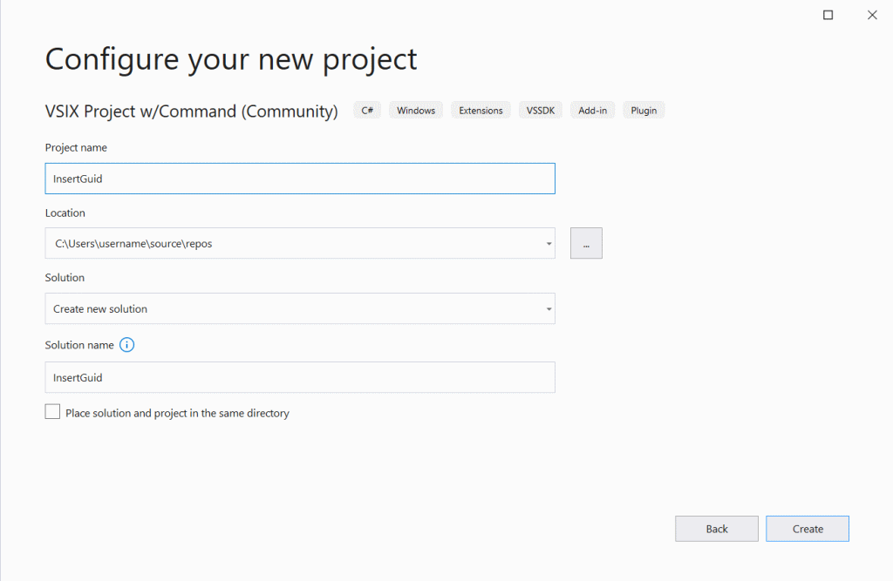
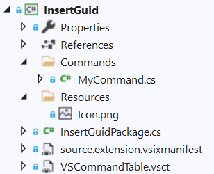
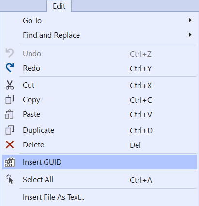

A Visual Studio extension is written using the .NET Framework and C#.
If you're already a .NET developer, you will find that writing extensions is similar to writing most other .NET programs and libraries.

The extension we'll be writing today adds a command that inserts a new guid into the text editor when executed. It's simple, useful, and provides a good introduction to the various aspects of extension development.

Before we start writing our first Visual Studio extension (it's easy, I promise!), make sure you've got the [tools needed](get-the-tools.md).

## Create the project
There are several project templates to choose from, so we want to make sure we make the right choice. The templates we use in this cookbook, all have the moniker **(Community)** in the name.

This time, we'll select the **VSIX Project w/Command (Community)** template, as shown in the screenshot below.


After selecting the project template, we need to give our project a name. Call it **InsertGuid**.



After hitting the *Create* button, you should end up with a basic VSIX Project looking like this:



## Overview of the files
Let's go over the most important files.

**InsertGuidPackage.cs** is what we refer to as the Package class. Its `InitializeAsync(...)` method is called by Visual Studio to initialize your extension. It's from here you add event listeners and register commands, tool windows, settings and other things.

**source.extension.vsixmanifest** is the manifest file for your extension. It contains meta data such as title and description, but also information about what the extension contains.

**VSCommandTable.vsct** is an XML file where commands and keybindings are declaratively defined, so they can be registered with Visual Studio.

**Commands/MyCommand.cs** is the command handler for the command defined in the *VSCommandTable.vsct* file. It controls what happens when the command is executed - aka. the button is clicked.

## Modifying the command
First, we want to make sure our command has the right name, icon, and position within the Visual Studio menu system.

Open the *VSCommandTable.vsct* file and find a `<Group>` and a `<Button>`. Notice how the button specifies the group as being its parent and the group's parent is the built-in *VSMainMenu/Tools* menu.

For our extension, we want the *Insert GUID* command button to be under the *Edit* main menu, so we are going to re-parent the group to match.

```xml
<Group guid="InsertGuid" id="MyMenuGroup" priority="0x0600">
  <Parent guid="VSMainMenu" id="Edit"/>
</Group>
```

You get full IntelliSense for the placements to make it easy to find the right spot.


The `<Button>` needs updating as well. We'll give it a new icon, update the button text and it's canonical name.

```xml
<Button guid="InsertGuid" id="MyCommand" priority="0x0100" type="Button">
  <Parent guid="InsertGuid" id="MyMenuGroup" />
  <Icon guid="ImageCatalogGuid" id="PasteAppend" />
  <CommandFlag>IconIsMoniker</CommandFlag>
  <Strings>
    <ButtonText>Insert GUID</ButtonText>
    <LocCanonicalName>.Edit.InsertGuid</LocCanonicalName>
  </Strings>
</Button>
```

We can use the thousands of icons available within Visual Studio's image library and even get a preview shown in IntelliSense:


Now, we've updated the name, icon, and location of our command and it's time to write some code to insert the guid into the text editor.

Open the */Commands/MyCommand.cs* file and modify it to insert a new guid when executed:

```csharp
using System;
using Community.VisualStudio.Toolkit;
using EnvDTE;
using Microsoft.VisualStudio.Shell;
using Task = System.Threading.Tasks.Task;

namespace InsertGuid
{
    [Command(PackageIds.MyCommand)]
    internal sealed class MyCommand : BaseCommand<MyCommand>
    {
        protected override async Task ExecuteAsync(OleMenuCmdEventArgs e)
        {
            await ThreadHelper.JoinableTaskFactory.SwitchToMainThreadAsync();
            TextDocument doc = await VS.Editor.GetActiveTextDocumentAsync();

            doc?.Selection.Insert(Guid.NewGuid().ToString());
        }
    }
}
```

We're using the `VS` object to get the active document, and then inserts the guid in the selection. There is always a selection in the editor even if it is zero length.

The first draft of our extension is now complete and it is time to test it.

## Running and debugging
Running your extension is as easy as running any other .NET project. Simply hit *F5* to run with the debugger attached or *Ctrl+F5* for running without.

Doing so will start the Experimental Instance of Visual Studio with your extension installed. The Experimental Instance is your regular version of Visual Studio, but with separate settings and extensions installed. It helps keep things separate.

When the Experimental Instance starts up, you should see the *Insert GUID* command in the *Edit* main menu.



Open any text based file and execute the command to insert a new guid. That's it!

## Summary
You've now created your first extension that adds a command button to the main menu and interacts with the text editor when executed. 

Congratulations!!

You can find the code for this extension in the [samples repository](https://github.com/VsixCommunity/Samples).

## Continue your learning journey

* [Anatomy of extensions](extension-anatomy.md)
* [Menus & Commands](../walkthroughs/menus-buttons-commands.html)
* [Best practices checklist](../publish/checklist.html)
