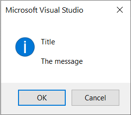

There are several mechanisms for displaying notifications to the user of your extension. Picking the right one can be challenging, so let's look at the options.

## Message box
There are various ways of showing a message box using .NET. For instance through Windows Forms or WPF. They cause some issues in Visual Studio extensions with parenting correctly against the main window, so it is recommended to use Visual Studio's own message box.



Use a message box when you need to block the UI to get the full attention of the user.

```csharp
// Simple text box
VS.Notifications.ShowMessage("Title", "The message");

// With buttons defined
VS.Notifications.ShowMessage("Title", "The message", OLEMSGICON.OLEMSGICON_INFO, OLEMSGBUTTON.OLEMSGBUTTON_OKCANCEL);   
```

## Status bar
The status bar can display text and show animation icons and we there's an API for using that.


Use the status bar when you don't need to take the full attention of the user, but still give them information.

### Set the text
This will set the text in the statusbar to any string.

```csharp
// call it from an async context
await VS.Notifications.SetStatusbarTextAsync("My text");

// or from a synchronous method:
VS.Notifications.SetStatusbarTextAsync("My text").FireAndForget();
```

### Animation icon
Adding an animation icon to the status bar is easy.


Simply specify which animation icon to use.

```csharp
// call it from an async context
await VS.Notifications.StartStatusbarAnimationAsync(StatusAnimation.Sync);

// or from a synchronous method:
VS.Notifications.StartStatusbarAnimationAsync(StatusAnimation.Sync).FireAndForget();
```

Stop the animation again by calling `EndStatusbarAnimationAsync`.

```csharp
// call it from an async context
await VS.Notifications.EndStatusbarAnimationAsync(StatusAnimation.Sync);

// or from a synchronous method:
VS.Notifications.EndStatusbarAnimationAsync(StatusAnimation.Sync).FireAndForget();
```
